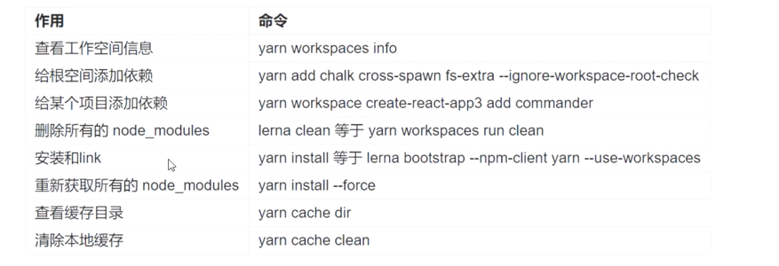

## yarn workspace - 内置功能，不需要额外安装什么东西

1. yarn workspace允许我们使用 monorepo 的形式来管理项目
2. 在安装 node_modules 的时候，它不会安装到每个子项目的 node_modules 下面，而是直接安装到根目录下面， 这样每个子项目都能读取到根目录下的 node_modules
3. 整个项目只有根目录下面会有一份 yarn.lock 文件。 子项目会被link到 node_modules 里面，这样就允许我们直接可以用 import导入对应的项目
4. yarn.lock是自动生成的，也完全由yarn来处理，yarn.lock锁定你安装的每个依赖项的版本，确保不会获得意外不良依赖

* package.json添加 workspaces
* lerna.json添加  useWorkspaces、npmClient

### lerna 和 yarn 的选择
* 两者很多功能都是等价的
* yarn用来处理依赖，lerna用于初始化和发布

## 创建软连接
```angular2html
cd vue3-cli-learning/packages/zhangli-cli
npm link
npm root -g -> /usr/local/lib/node_modules
```
### 添加依赖
yarn 可以将我们package的模块链接起来，不用以前各种link了
加速镜像



```
yarn config set registry http://registry.npm.taobao.org
npm config set registry http://registry.npm.taobao.org

cd package /zhangli-cli-shared-utils
yarn workspace zhangli-cli-shared-utils add chalk execa

cd package/zhangli-cli
yarn workspace zhangli-cli add commander inquirer chalk execa ejs globby fs-extra ora isbinaryfile lodash 
```
## commander - 提供了用户命令行输入和参数解析功能


